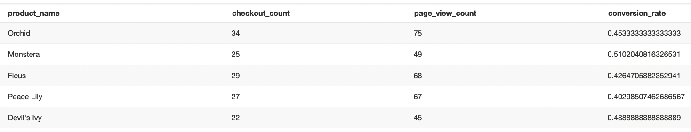

# Week 3

> What is our overall conversion rate? Conversion rate is defined as the # of unique sessions with a purchase event / total number of unique sessions.

```sql
select
    sum(case when event_type = 'checkout' then 1 else 0 end) as checkout_sessions
    , count(distinct session_guid) as unique_sessions
    , sum(case when event_type = 'checkout' then 1 else 0 end)::float / count(distinct session_guid)::float as overall_conversion_rate
  
from "dbt"."dbt_kan_o"."stg_greenery__events"
```

Overall conversion rate is 0.6245674740484429.

> What is our conversion rate by product? Conversion rate by product is defined as the # of unique sessions with a purchase event of that product / total number of unique sessions that viewed that product

```sql
with

page_view_count_by_product as (

    select
        p.product_guid
        , p.name as product_name
        , sum(case when e.event_type = 'page_view' then 1 else 0 end) as page_view_count

    from "dbt"."dbt_kan_o"."stg_greenery__events" as e
    left join "dbt"."dbt_kan_o"."stg_greenery__products" as p
        on e.product_guid = p.product_guid
    where
        e.product_guid is not null
    group by 1, 2

)

, checkout_count_by_product as (

    select
        po.product_guid
        , po.product_name
        , sum(case when e.event_type = 'checkout' then 1 else 0 end) as checkout_count

    from "dbt"."dbt_kan_o"."stg_greenery__events" as e
    left join "dbt"."dbt_kan_o"."int_product_orders__joined" po
        on e.order_guid = po.order_guid
    where
        e.order_guid is not null
    group by 1, 2

)

, final as (

    select
        co.product_name
        , checkout_count
        , page_view_count
        , checkout_count::float / page_view_count::float as conversion_rate

    from checkout_count_by_product as co
    join page_view_count_by_product as pv
        on co.product_guid = pv.product_guid

)

select * from final
```

See the results below:

