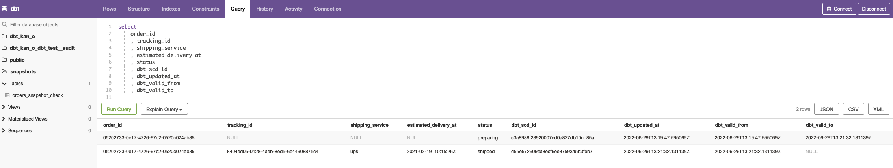

# Week 4

> How do the data change for the two orders after run `dbt snapshot`?

After we ran the following queries:

```sql
UPDATE
    orders
SET
    tracking_id = 'a807fe66-d8b1-4d38-b409-558fed8bd75f',
    shipping_service = 'ups',
    estimated_delivery_at = '2021-02-19T10:15:26Z',
    status = 'shipped'
WHERE
    order_id = '914b8929-e04a-40f8-86ee-357f2be3a2a2';
```

```sql
UPDATE
    orders
SET
    tracking_id = '8404ed05-0128-4aeb-8ed5-6e44908875c4',
    shipping_service = 'ups',
    estimated_delivery_at = '2021-02-19T10:15:26Z',
    status = 'shipped'
WHERE
    order_id = '05202733-0e17-4726-97c2-0520c024ab85';
```

Here are the results from the `dbt snapshot`:

The log shows that there are 2 rows got inserted.




> Product funnel


> Exposure to represent that the product funnel is being used in a BI tool


